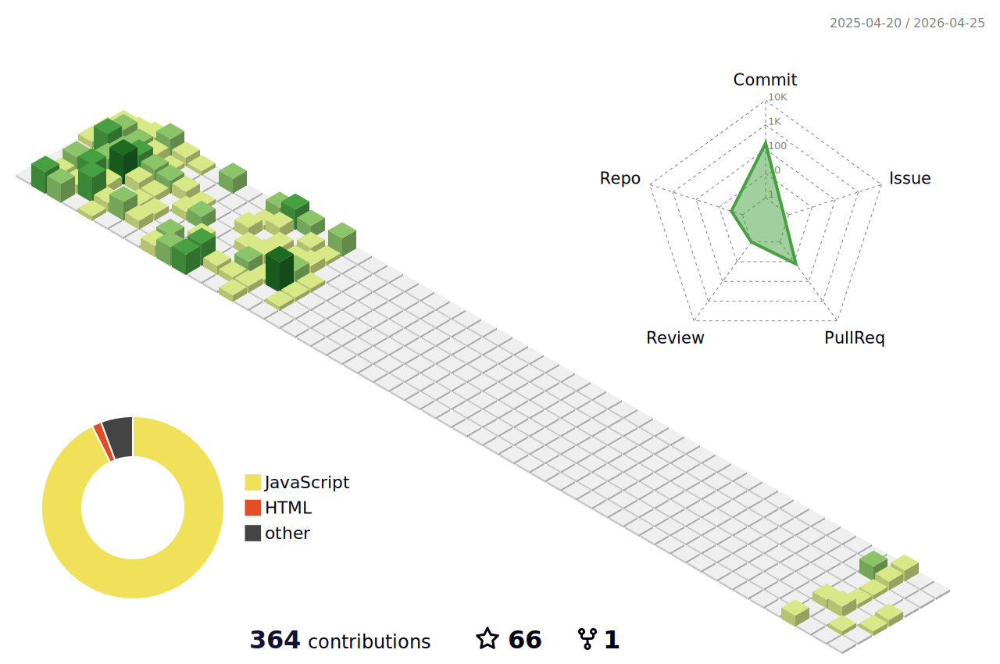
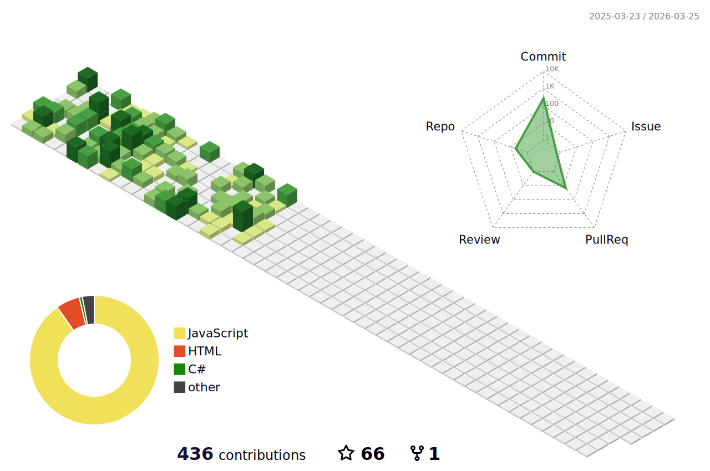
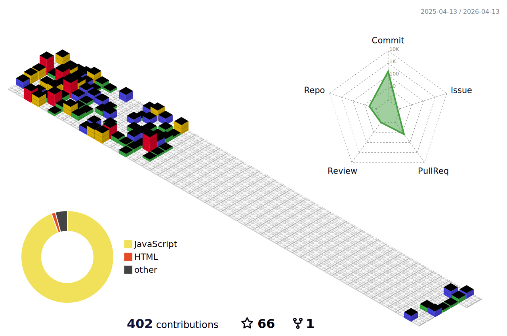
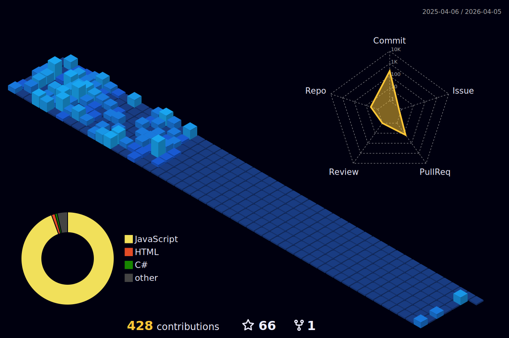
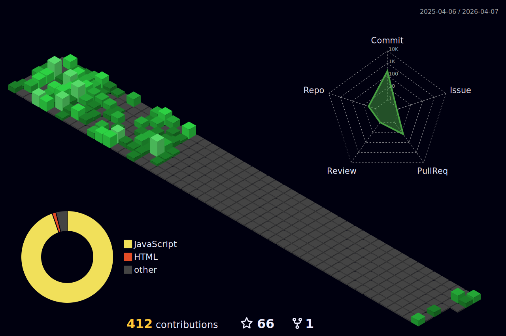
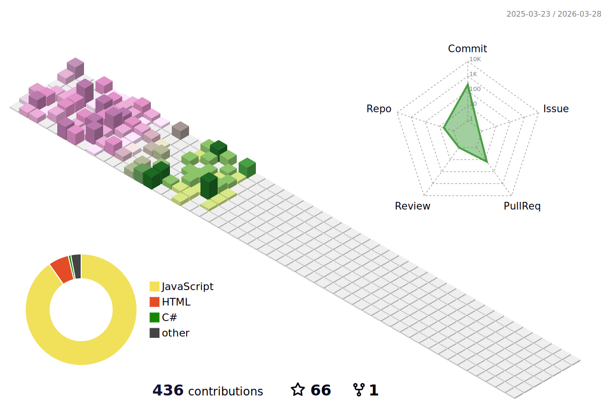
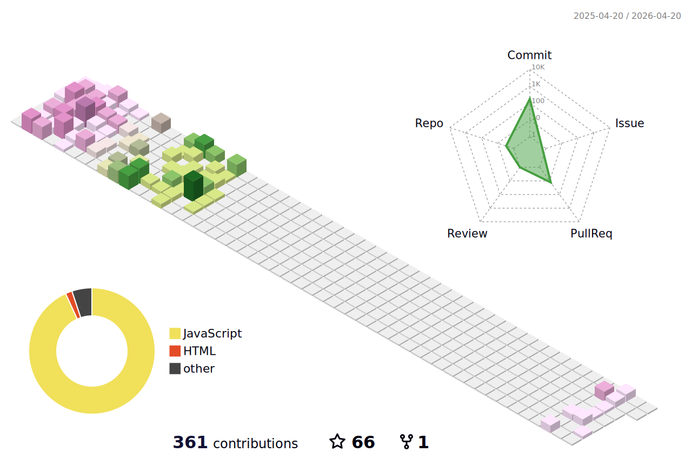
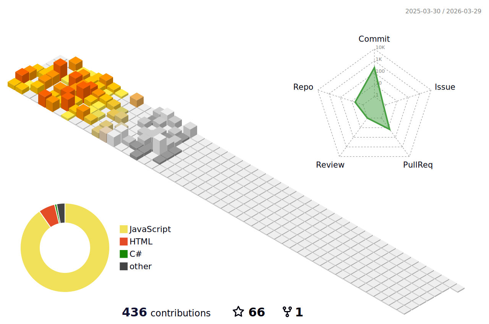
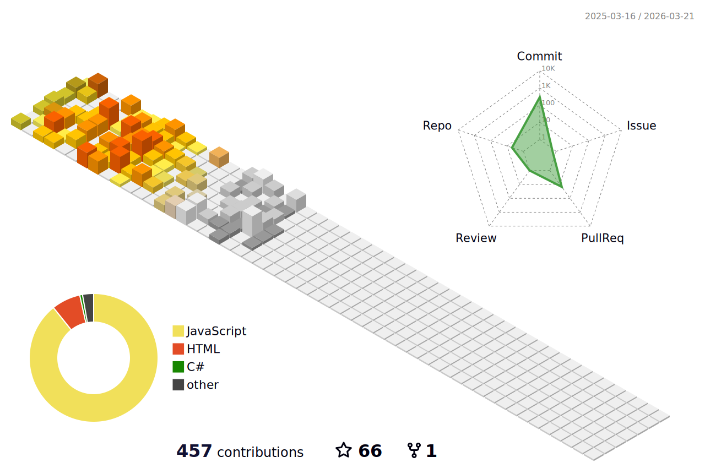

<!-- ### 🧱 GitHub 3D Contribution Visuals

| Theme                  | Preview |
|------------------------|---------|
| 🟩 Green               |  |
| 🟢 Green Animated      |  |
| 🧱 GitBlock            |  |
| 🌃 Night View          |  |
| 🌌 Night Green         |  |
| 🌈 Night Rainbow       |  |
| 🌼 Season              |  |
| 🌸 Season Animated     |  |
| 🌞 South Season        |  |
| 🌴 South Season Animated|  | -->

---
   
   
   
  
    
  
   

### 🚀 Skills

**Front-End Development:**

**Back-End Development:**

**Database & Data Management:**

**Concepts:**

---
<picture>
  <source media="(prefers-color-scheme: dark)" srcset="https://raw.githubusercontent.com/ZakaDev22/ZakaDev22/output/github-snake-dark.svg" />
  <source media="(prefers-color-scheme: light)" srcset="https://raw.githubusercontent.com/ZakaDev22/ZakaDev22/output/github-snake.svg" />
  
</picture>
